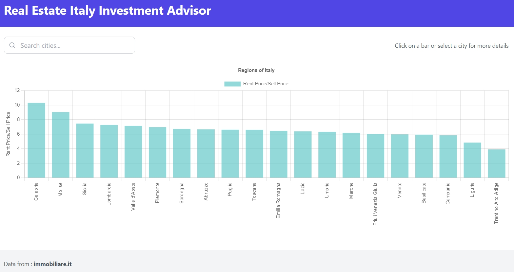
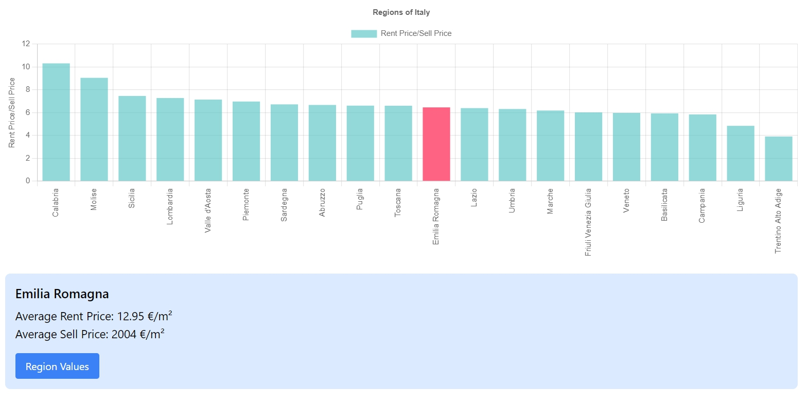
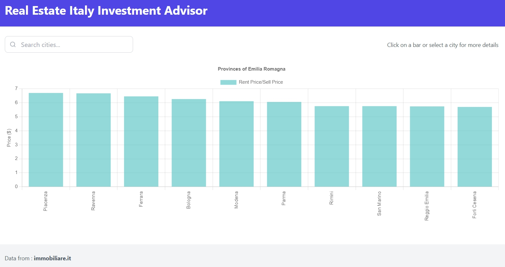
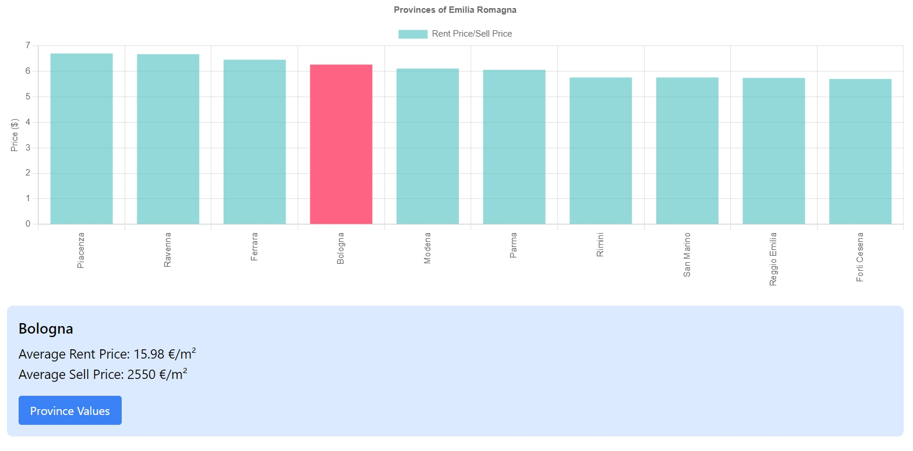
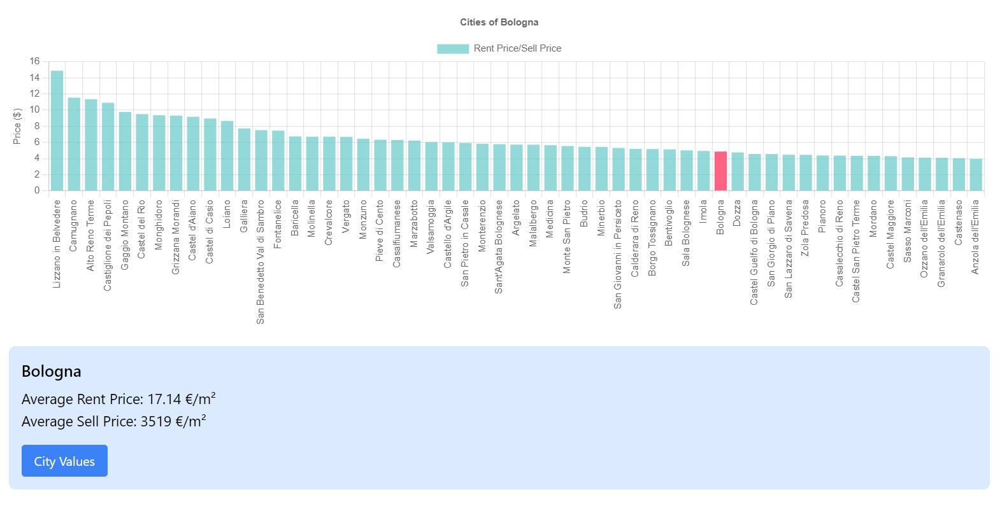
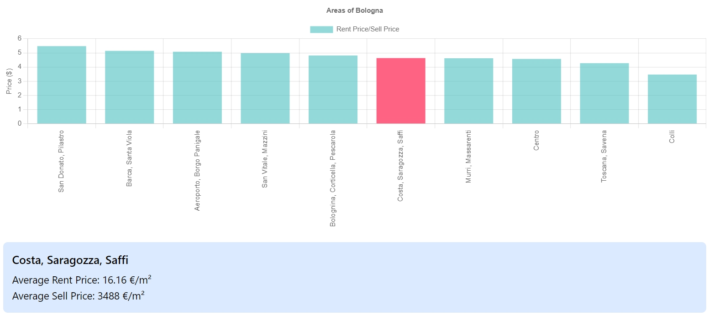

# Real Estate Italy Investment Advisor

The goal of this project is to have an overview of Italy Real Estate market by investment point of view.

The frontend, a React application, is a dashboard that represents the areas of Italy (Regions, Provinces, Cities, Areas of Cities) by the ratio Rent price/Sell price. In this way, where the ratio is higher is, in theory, more convenient to buy for investment. 

The Backend, a FastAPI application, scrapes data of specific area from [Immobiliare.it](https://www.immobiliare.it/mercato-immobiliare/) and transforms it.

The purpose is just to provide an overview and some advisors.

All row data for the analysis are scraped from [Immobiliare.it](https://www.immobiliare.it/mercato-immobiliare/)

## Run project

```
docker-compose up --build
```

## How to use

visit [localhost:3000](http://localhost:3000/)



Now you have an overview about Italian regions. 

Click or write a region to see details and navigate inside the values : 



Clicking on the button you can go inside the values of selected Region : 



And in the same way you can see the values of selected Province and go inside them :



In the Province's values, if the selected City have also areas values you can go inside them : 



And then you can see the deepest overview, the City's areas : 


